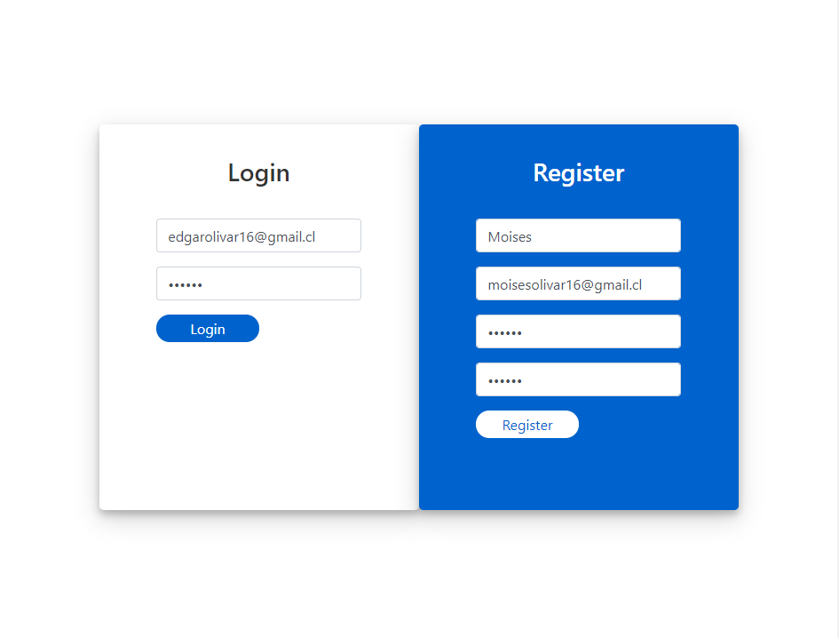
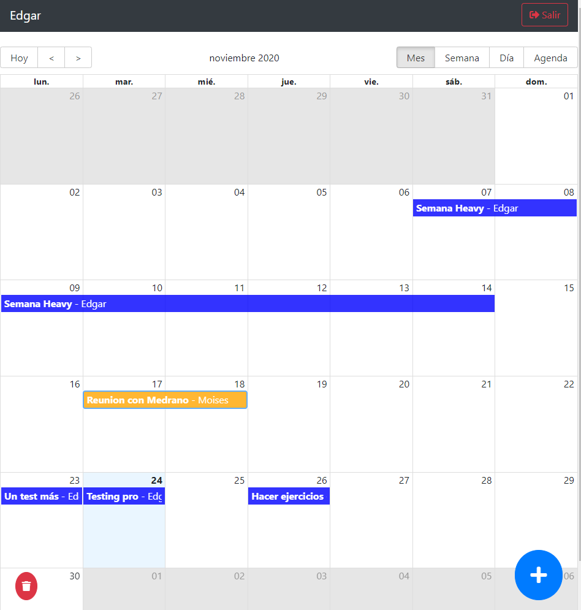
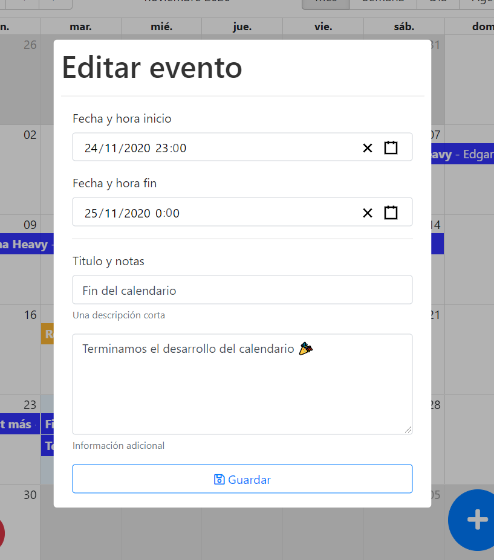

This project was bootstrapped with [Create React App](https://github.com/facebook/create-react-app).

# React Calendar App

This a Calendar project, you can create a account, login with email and password
create/update/delete events, write about your day or other scheduler

This project use react big calendar, react modal and more, redux, router (public and private), helpers and more!

Snaps:
1. LoginScreen:

  

2. Calendar:

  

3. Modal event:

  

run ``` npm install ```

This examples are part from the [react: De cero a Experto (Hooks y MERN) course](https://www.udemy.com/course/react-cero-experto)